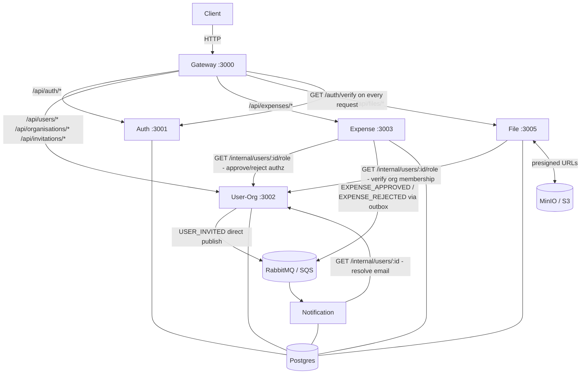

# Multi-Tenant Expense Management System

A production-grade microservices application for managing employee expenses across organisations. Companies onboard to the platform, invite their team, and run a full approval workflow — employees submit expenses, managers approve or reject them, and everyone gets notified in real time.

Built as a learning project covering microservices architecture, event-driven patterns (outbox, idempotency), AWS infrastructure, and distributed tracing.

---

## Architecture



### Service responsibilities

| Service | Port | Responsibility |
|---|---|---|
| **gateway** | 3000 | Single entry point. Verifies JWT, injects `x-user-id` / `x-user-email` headers, proxies to downstream services. Blocks `/internal/*`. |
| **auth** | 3001 | Identity only — register, login, refresh, logout, verify. Issues JWTs, stores bcrypt hashes and refresh tokens. No profile or org knowledge. |
| **user-org** | 3002 | Profiles, organisations, memberships, invitations. Source of truth for RBAC. Exposes internal endpoints for role lookups and email resolution. |
| **expense** | 3003 | Core domain — expense CRUD, state machine (DRAFT → PENDING → APPROVED/REJECTED), outbox pattern for reliable event publishing. |
| **file** | 3005 | Generates presigned S3/MinIO PUT and GET URLs. Receipt bytes never pass through the server. |
| **notification** | — | RabbitMQ/SQS consumer only (no HTTP). Sends emails via Resend. Idempotent — deduplicates on `eventId`. |

### Expense state machine

```
DRAFT ──submit──▶ PENDING ──approve──▶ APPROVED
                      │
                   reject
                      │
                      ▼
                  REJECTED ──resubmit──▶ DRAFT
```

Only MANAGER or OWNER can approve/reject. Self-approval is blocked. Only the original submitter can resubmit.

---

## Tech stack

- **Runtime**: Node.js 20, TypeScript (strict)
- **Framework**: Express
- **ORM / migrations**: Drizzle ORM + drizzle-kit
- **Database**: PostgreSQL 15 (one instance, five databases)
- **Cache**: Redis 7
- **Message broker**: RabbitMQ locally → AWS SQS in production (switched via `QUEUE_DRIVER` env var)
- **Object storage**: MinIO locally → AWS S3 in production (switched via `S3_ENDPOINT` env var)
- **Email**: Resend SDK
- **Tracing**: OpenTelemetry + Jaeger
- **Containers**: Docker + Docker Compose

---

## Local setup

**Prerequisites**: Docker Desktop, Node.js 20

```bash
# 1. Clone and copy env
git clone <repo-url>
cd multi-tenant-expense-management-sys
cp .env.example .env

# 2. Start all infrastructure (Postgres, Redis, RabbitMQ, MinIO, Jaeger)
docker compose up -d postgres redis rabbitmq minio jaeger

# 3. Install dependencies and run a service in dev mode
cd services/auth
npm install
npm run dev
```

To start everything at once (after images are built):

```bash
docker compose up -d
```

### Ports at a glance

| Service | URL |
|---|---|
| Gateway | http://localhost:3000 |
| Auth | http://localhost:3001 |
| User-Org | http://localhost:3002 |
| Expense | http://localhost:3003 |
| File | http://localhost:3005 |
| RabbitMQ UI | http://localhost:15672 (guest / guest) |
| MinIO Console | http://localhost:9001 (minioadmin / minioadmin) |
| Jaeger UI | http://localhost:16686 |

### Per-service commands

Run from inside a service directory (e.g. `cd services/expense`):

```bash
npm run dev          # hot-reload dev server (ts-node-dev)
npm run build        # compile TypeScript → dist/
npm run typecheck    # tsc --noEmit, no output files

# Drizzle migrations
npx drizzle-kit generate   # generate migration from schema change
npx drizzle-kit migrate    # apply to local Postgres
```

---

## Key design decisions

### Auth / user-org separation
`auth` owns only credentials (email, password hash, refresh tokens). `user-org` owns everything else — profiles, orgs, roles. This means the auth service has no dependency on the organisation model and can be replaced or scaled independently.

### Outbox pattern
When an expense is approved or rejected, the status update and the event payload are written in **a single Postgres transaction** to the `expenses` and `outbox` tables. A background worker polls `outbox` using `SELECT … FOR UPDATE SKIP LOCKED` and publishes to the broker. This guarantees the event is never lost even if the process crashes between the DB write and the publish.

### RabbitMQ → SQS via env var
All broker interactions are behind a thin driver abstraction. Set `QUEUE_DRIVER=rabbitmq` for local dev (RabbitMQ container) or `QUEUE_DRIVER=sqs` for production (AWS SQS). No code changes required.

### File uploads bypass the server
The file service issues a presigned S3/MinIO PUT URL. The client uploads directly — bytes never pass through Node.js. The same code targets MinIO locally (`S3_ENDPOINT=http://localhost:9000`) and real S3 in production (`S3_ENDPOINT` unset, IAM role assumed automatically).

### Gateway header injection
The gateway calls `GET /auth/verify` on every authenticated request. Before forwarding, it **strips any client-supplied `x-user-*` headers** to prevent identity spoofing, then injects trusted `x-user-id` and `x-user-email` from the verify response. Downstream services trust these headers without re-verifying the JWT.

---

## AWS production infrastructure

| Component | Service |
|---|---|
| Database | RDS PostgreSQL 15 (`db.t3.micro`, 5 databases on one instance) |
| Object storage | S3 (`expense-app-receipts-*`, all public access blocked) |
| Message queues | SQS Standard (`expense-events`, `notification-jobs`, each with a DLQ) |
| Container registry | ECR (one repo per service under `expense-app/`) |
| Compute | EC2 `t3.micro`, Amazon Linux 2023, IAM instance profile |
| Secrets | AWS Secrets Manager (no credentials baked into images) |
| Tracing | Jaeger (local) — swap exporter endpoint for a managed collector in production |

---

## Shared types package

All event payloads, role enums, and status enums live in `packages/types` and are imported by services as `@app/types`:

```typescript
import { Role, ExpenseStatus, ExpenseApprovedEvent } from '@app/types';
```

Every event payload includes an `eventId` field used by consumers for idempotency.

---

## Future work

- Audit log service (immutable record of every status change)
- Expense budget limits and policy rules per org
- Redis caching on `/auth/verify` to reduce auth service load
- Circuit breaker on inter-service HTTP calls
- Frontend (React + tRPC or REST)
- ECS / Kubernetes deployment replacing single-EC2 setup
